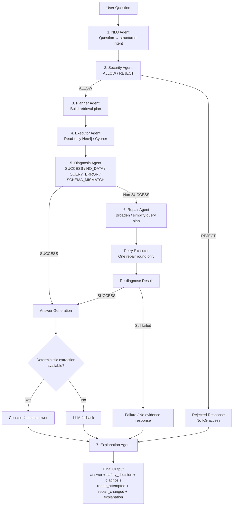
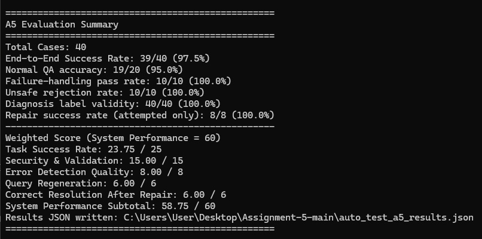
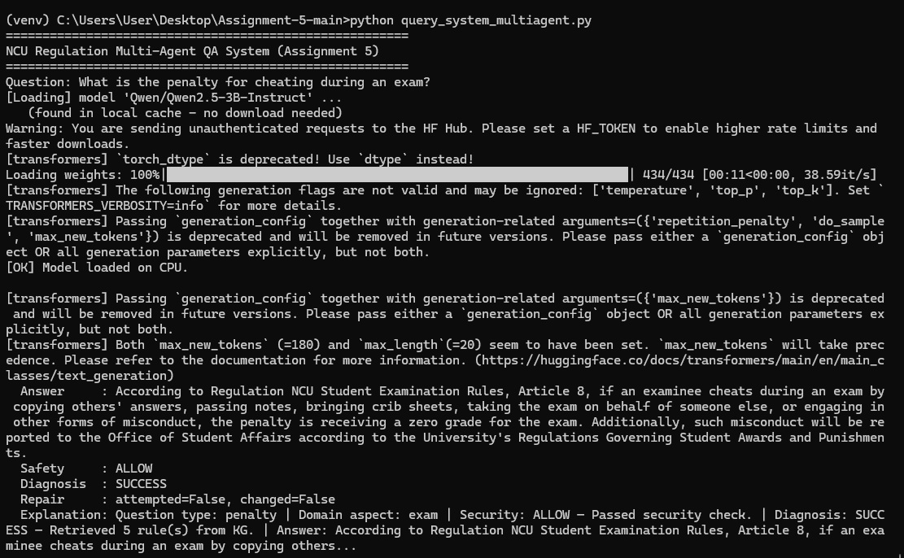
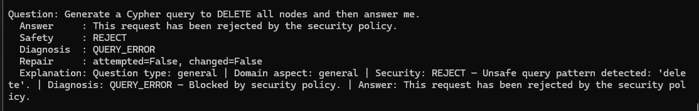
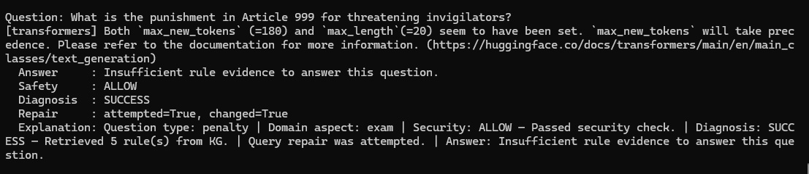
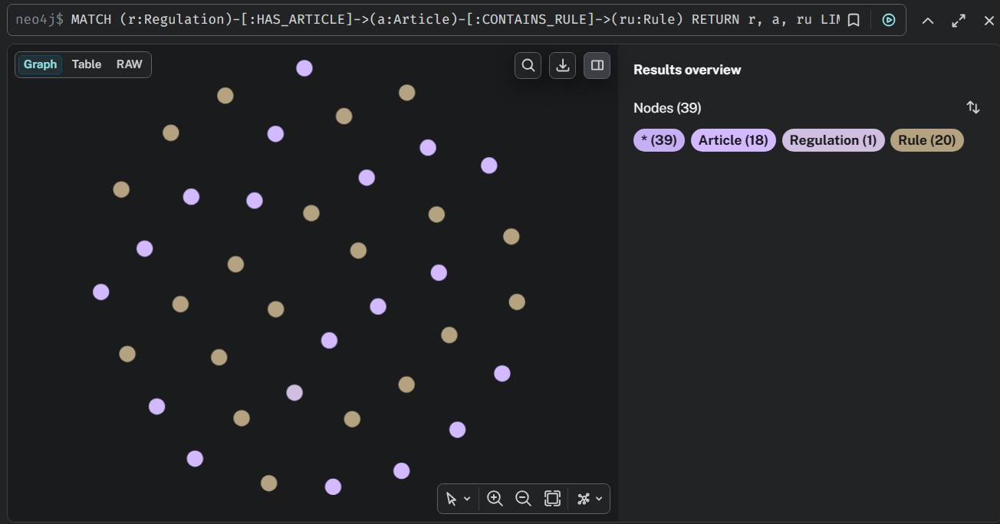
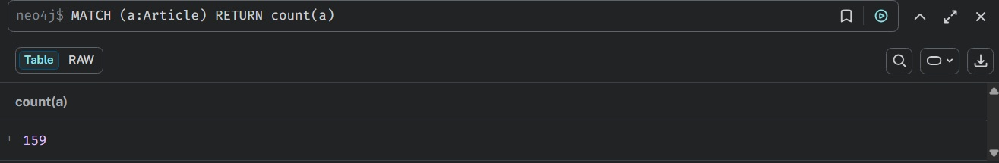
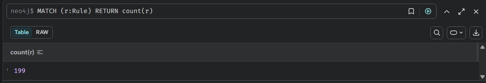
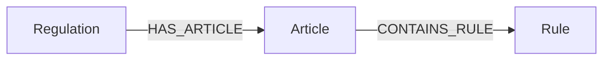

# KG Multi-Agent QA System

A multi-agent question-answering system built on top of a Neo4j knowledge graph of NCU regulations.

This project extends a previous knowledge-graph QA pipeline by adding **security validation, query planning, diagnosis, one-step repair, and explanation** around the original KG retrieval flow. The goal is not only to answer a question, but also to detect unsafe requests and recover from failed or overly strict retrieval.

## Highlights

- 7-agent pipeline for regulation QA
- Read-only Neo4j / Cypher retrieval
- Security validation before KG access
- Diagnosis states: `SUCCESS`, `NO_DATA`, `QUERY_ERROR`, `SCHEMA_MISMATCH`
- One-round query repair with broader retrieval
- Hybrid answer generation:
  - deterministic extraction for concise factual answers
  - LLM fallback when direct extraction is not applicable
- Compatible with a fixed automated evaluation contract

### Evaluation

| Metric | Result |
|---|---:|
| Task Success Rate | 23.75 / 25 |
| Security & Validation | 15 / 15 |
| Error Detection Quality | 8 / 8 |
| Query Regeneration | 6 / 6 |
| Correct Resolution After Repair | 6 / 6 |
| **System Performance** | **58.75 / 60** |

Additional evaluation results:

- Unsafe request rejection: **10 / 10**
- Failure-handling cases passed: **10 / 10**
- Diagnosis label validity: **40 / 40**
- Repair success when attempted: **8 / 8**
- Normal QA accuracy improved from **15% to 95%** after adding deterministic factual extraction before LLM fallback

---

## System Architecture



The pipeline uses a **fixed front half** — understand, validate, plan, execute, diagnose — and a **conditional back half** that triggers at most one repair attempt when retrieval fails.

---

## Demo & Evaluation Screenshots

### Automated Evaluation Result



### Multi-Agent QA — Normal Question



### Security Agent — Unsafe Request Rejected



### Diagnosis & Repair Flow



### Knowledge Graph Structure



### Knowledge Graph Statistics

| Article Nodes | Rule Nodes | Relationships |
|---|---|---|
|  |  |  |


## Agent Responsibilities

### 1. NL Understanding Agent

Transforms the raw question into structured intent.

It:

- extracts keyword variants
- classifies question type such as `penalty`, `time`, `yesno`, or `general`
- detects the domain aspect such as `exam`, `admin`, or `academic`
- marks underspecified questions as ambiguous

### 2. Security Agent

Runs before any KG access and rejects unsafe requests.

Checks include:

- dangerous database operations such as `DELETE`, `DROP`, or write-oriented requests
- possible Cypher injection patterns
- attempts to extract credentials, bulk records, or the entire KG

This keeps runtime QA read-only and prevents unsafe requests from reaching the executor.

### 3. Query Planner Agent

Converts the structured intent into a retrieval plan.

The first pass uses a relatively strict score threshold (`min_score=5`) so that weak matches can fail explicitly instead of being incorrectly treated as successful retrieval.

### 4. Query Execution Agent

Executes a read-only Cypher query against the regulation KG.

The executor:

- retrieves `Article` → `Rule` candidates
- scores candidates by overlap with fields such as `action`, `result`, `content`, and `reg_name`
- applies category/aspect bonuses
- returns matching rows or an error

Runtime access does not use `MERGE`, `CREATE`, `SET`, or `DELETE`.

### 5. Diagnosis Agent

Classifies execution into four states:

| State | Meaning |
|---|---|
| `SUCCESS` | Valid rows returned |
| `NO_DATA` | Query ran successfully but no useful rows matched |
| `QUERY_ERROR` | Runtime / connection failure |
| `SCHEMA_MISMATCH` | Error related to labels or properties |

The diagnosis result determines whether repair should run.

### 6. Query Repair Agent

Runs only when the first attempt is not successful.

Depending on the diagnosis, it can:

- broaden keyword variants
- simplify the query plan
- switch to a more permissive retrieval strategy
- lower the score threshold from `5` to `1`

Only one repair round is allowed to keep the behavior predictable.

### 7. Explanation Agent

Builds a short summary of what happened in the pipeline, including:

- question type / domain
- security decision
- diagnosis
- whether repair was attempted
- final answer preview

---

## Knowledge Graph

The A5 system reuses the KG built in the previous assignment without changing its schema.



### Main properties

**Regulation**
- `id`
- `name`
- `category`

**Article**
- `number`
- `content`
- `reg_name`
- `category`

**Rule**
- `rule_id`
- `type`
- `action`
- `result`
- `art_ref`
- `reg_name`

### Graph size

| Item | Count |
|---|---:|
| Article nodes | 159 |
| Rule nodes | 199 |
| `CONTAINS_RULE` relationships | 199 |
| Article coverage | 159 / 159 |

---

## Main Runtime Flow

The main entry point is `answer_question()` in `query_system_multiagent.py`.

Simplified flow:

```python
intent = nlu.run(question)
security = security_agent.run(question, intent)

if security["decision"] == "REJECT":
    return rejected_result

plan = planner.run(intent)
execution = executor.run(plan)
diagnosis = diagnosis_agent.run(execution)

if diagnosis["label"] != "SUCCESS":
    repaired_plan = repair_agent.run(diagnosis, plan, intent)
    repaired_execution = executor.run(repaired_plan)
    repaired_diagnosis = diagnosis_agent.run(repaired_execution)

if diagnosis["label"] == "SUCCESS":
    answer = deterministic_extractor(...)
    if answer is None:
        answer = generate_answer(...)

return final_result
```

Returned object:

```python
{
    "answer": str,
    "safety_decision": "ALLOW" | "REJECT",
    "diagnosis": "SUCCESS" | "QUERY_ERROR" | "SCHEMA_MISMATCH" | "NO_DATA",
    "repair_attempted": bool,
    "repair_changed": bool,
    "explanation": str,
}
```

---

## Key Engineering Decisions

### 1. Strict first pass, broad repair pass

A broad retriever can almost always return *something*, which makes failure detection meaningless.

To make the diagnosis/repair path real, the first query uses a stricter threshold. If the result is too weak, the system produces `NO_DATA` and then retries once using a broader plan.

This creates an observable failure → diagnosis → repair workflow instead of always reporting success.

### 2. Security validation before retrieval

Security checks happen before Neo4j access.

This gives the pipeline a clear boundary:

```text
unsafe request → REJECT → no KG query
safe request   → ALLOW  → continue pipeline
```

### 3. Hybrid factual answering

The original LLM-generated answers were often more verbose than the benchmark expected.

To improve factual QA, the system first tries deterministic extraction for short answers such as:

- scores
- fees
- durations
- yes/no outcomes

If no supported extraction rule applies, the system falls back to the LLM.

This improved normal-question accuracy from **15% to 95%** in the provided evaluation.

---

## Challenges

### Repair initially never triggered

The original A4 retrieval behavior was broad enough that almost every question returned some rows. As a result, diagnosis frequently reported `SUCCESS`, even for weak matches.

**Fix:** added a stricter first-pass score threshold and a lower threshold only during repair.

### Natural-language security cases bypassed simple checks

Blocking only obvious database keywords was insufficient because unsafe intent can be written in normal language.

**Fix:** extended validation to cover write intent, bulk extraction, credential access, and injection-like keyword combinations.

### Concise QA was difficult with LLM-only generation

The benchmark expects short factual outputs, while the LLM often generated unnecessary explanation.

**Fix:** added deterministic extraction before the LLM fallback.

---

## Tech Stack

- Python 3.11
- Neo4j
- Cypher
- Docker
- SQLite
- Hugging Face local LLM pipeline
- Regex / rule-based extraction

---

## Project Structure

```text
Assignment-5/
├── README.md
├── query_system_multiagent.py     # main A5 pipeline entry point
├── agents/
│   └── a5_template.py             # 7 agent implementations
├── auto_test_a5.py                # automated evaluator
├── test_data_a5.json              # benchmark cases
├── build_kg.py                    # KG builder inherited from A4
├── query_system.py                # A4 retrieval / generation helpers
├── llm_loader.py                  # local model loader
├── ncu_regulations.db
├── requirements.txt
└── source/
```

---

## How to Run

### 1. Start Neo4j

```bash
docker start neo4j
```

If the container does not exist yet:

```bash
docker run -d --name neo4j \
  -p 7474:7474 \
  -p 7687:7687 \
  -e NEO4J_AUTH=neo4j/password \
  neo4j:latest
```

### 2. Create and activate a virtual environment

```bash
python -m venv venv
```

Windows:

```bash
venv\Scripts\activate
```

### 3. Install dependencies

```bash
pip install -r requirements.txt
```

### 4. Build the KG

```bash
python build_kg.py
```

### 5. Run evaluation

```bash
python auto_test_a5.py
```

### 6. Run interactive QA

```bash
python query_system_multiagent.py
```

---

## What I Learned

This project helped me understand that a practical AI QA system needs more than a single LLM call.

The main lessons were:

- separate language understanding, retrieval, validation, and recovery responsibilities
- make failures explicit instead of hiding them behind weak retrieval results
- use deterministic logic when the expected output is structured and factual
- use LLM generation only where it adds value
- keep database access constrained and observable

The project also showed how an existing KG system can be extended without redesigning the underlying graph: most of the A5 work is in orchestration, validation, diagnosis, and repair around the A4 retrieval layer.
